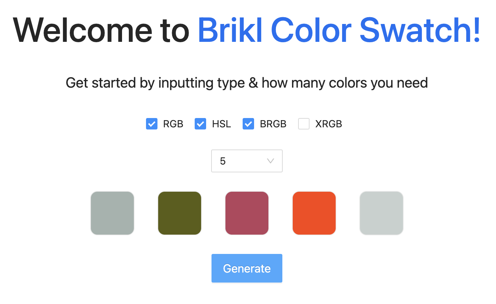
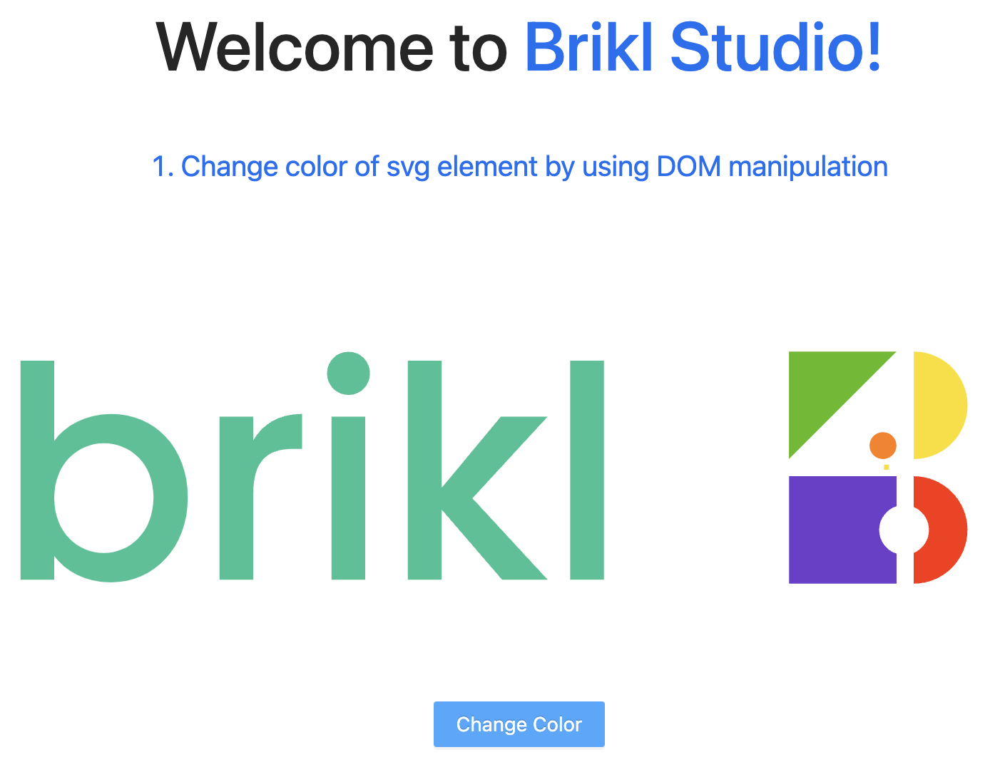
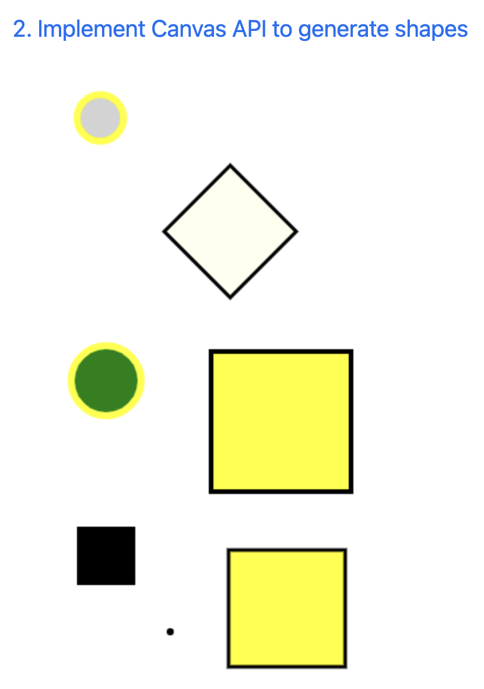
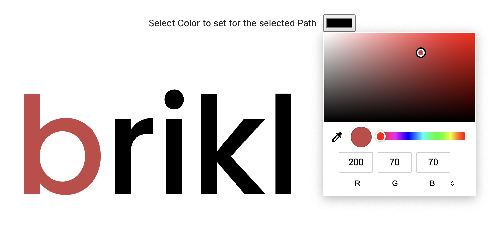
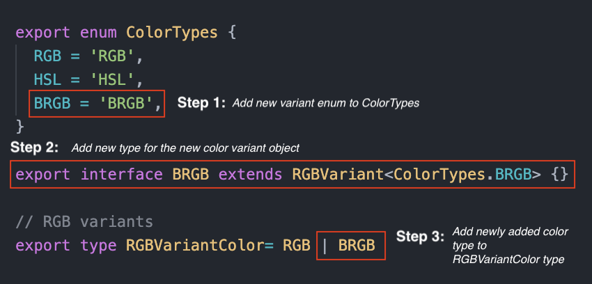
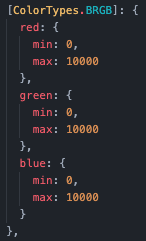
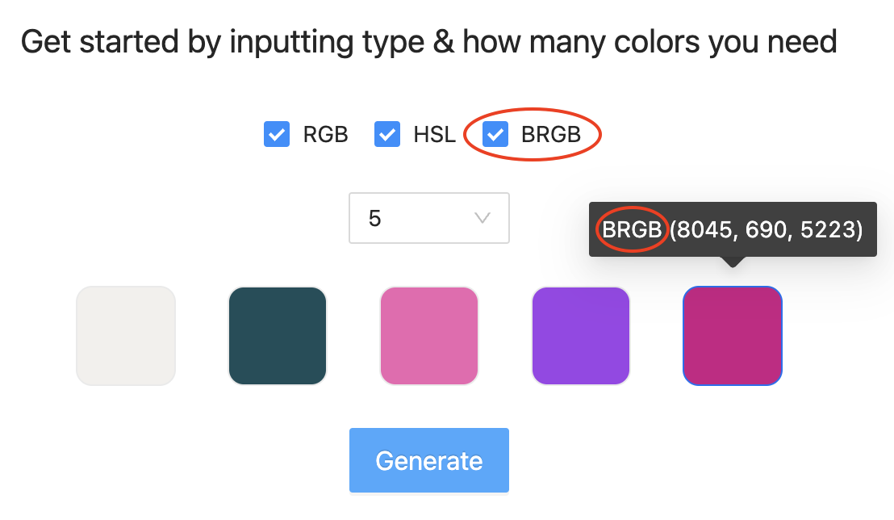

<div id="top"></div>
<div align="center">

[![LinkedIn][linkedin-shield]][linkedin-url]

</div>

<!-- PROJECT LOGO -->
<br />
<div align="center">
  <a href="https://amity-delivery-service.web.app">
    
  </a>
  <h1 align="center">Brikl Studio Assignment</h1>
  <p align="center">
    <a href="https://amity-delivery-service.web.app"><strong>View Demo »</strong></a>
    <br />
    <a href="#how-to-add-custom-color-space"><strong>How to add custom color spaces »</strong></a>
    <br />
    <br />
  </p>
</div>
<!-- TABLE OF CONTENTS -->
<details>
  <summary>Table of Contents</summary>
  <ol>
    <li>
      <a href="#about-the-project">About The Project</a>
      <ul>
        <li><a href="#how-to-add-custom-color-space">How to add custom color space</a></li>
        <li><a href="#built-with">Built With</a></li>
      </ul>
    </li>
    <li>
      <a href="#getting-started">Getting Started</a>
      <ul>
        <li><a href="#prerequisites">Prerequisites</a></li>
        <li><a href="#installation">Installation</a></li>
      </ul>
    </li>
    <li><a href="#contributing">Contributing</a></li>
    <li><a href="#contact">Contact</a></li>
  </ol>
</details>

<!-- ABOUT THE PROJECT -->

## About The Project

<div align="center">
  
  
  
  
</div>

In this Application you have the ability to

- Generate **color swatches** consisting **5, 10, 25 & 50** colors in defined color spaces (**RGB, HSL, Custom spaces BRGB etc...**)
- In studio page you have the ability to change colors of paths' in an svg with DOM manipulation and example usage of the canvas api to draw basic shapes.

### How to Add Custom Color Space

- You have the ability to introduce new variants of the RGB color space by following these baby steps
  - In ```types/color-types.ts``` you have to add the following type information for the new color space.
    <div align="center">
      
    </div>

  - In ```utils/color-rules.ts``` you have to add the rules for the new RGB variant color spaces as follows. The min max values of the each color components.
    <div align="center">
      
    </div>

  - Then in the home page color swatch generator, it will allow you to choose the new color variant and the backend will be able to generate random colors of this variant.
    <div align="center">
      
    </div>

<p align="right">(<a href="#top">back to top</a>)</p>

### Built With

- I have used [firebase](https://firebase.google.com/) storage to temporarily host this application to provide a quick preview to the observers.
- [React.js](https://reactjs.org/)
- [Next.js](https://nextjs.org/docs)
- [Typescript](https://www.typescriptlang.org/)
- [Ant Design](https://ant.design/)
- [Styled Components](https://styled-components.com/)
- [Lodash](https://lodash.com/)

<p align="right">(<a href="#top">back to top</a>)</p>

<!-- GETTING STARTED -->

## Getting Started

This is a [Next.js](https://nextjs.org/) project bootstrapped with [`create-next-app`](https://github.com/vercel/next.js/tree/canary/packages/create-next-app). with the typescript template.

[API routes](https://nextjs.org/docs/api-routes/introduction) can be accessed on [http://localhost:3000/api/hello](http://localhost:3000/api/hello).

The `pages/api` directory is mapped to `/api/*`. Files in this directory are treated as [API routes](https://nextjs.org/docs/api-routes/introduction) instead of React pages.

### Prerequisites

Make sure you have node installed in order to run this application locally.

- upgrade npm to the latest version

```sh
npm install npm@latest -g
```

### Installation

1. Clone the repo

```sh
git clone https://github.com/sudeshnt/brikl-assignment.git
```

2. Install node modules using one of the following commands

```sh
npm install
yarn
```

3. In the project directory, you can run either:

```js
npm run dev
yarn dev
```

4. Runs the app in the development mode.

Open [http://localhost:3000](http://localhost:3000) to view it in your browser

5. Launch the test runner in the interactive watch mode.

```js
npm test
```

6. Builds the app for production to the build folder.

```js
npm run build
yarn build
```

<p align="right">(<a href="#top">back to top</a>)</p>

<!-- CONTRIBUTING -->

## Contributing

Contributions are what make the open source community such an amazing place to learn, inspire, and create. Any contributions you make are **greatly appreciated**.

If you have a suggestion that would make this better, please fork the repo and create a pull request. You can also simply open an issue with the tag "enhancement".
Don't forget to give the project a star! Thanks again!

1. Fork the Project
2. Create your Feature Branch (`git checkout -b feature/AmazingFeature`)
3. Commit your Changes (`git commit -m 'Add some AmazingFeature'`)
4. Push to the Branch (`git push origin feature/AmazingFeature`)
5. Open a Pull Request
<p align="right">(<a href="#top">back to top</a>)</p>

<!-- CONTACT -->
## Contact

Sudesh Nimesha - sudeshnt93@gmail.com

<p align="right">(<a href="#top">back to top</a>)</p>

<!-- MARKDOWN LINKS & IMAGES -->
<!-- https://www.markdownguide.org/basic-syntax/#reference-style-links -->

[linkedin-shield]: https://img.shields.io/badge/-LinkedIn-black.svg?style=for-the-badge&logo=linkedin&colorB=555
[linkedin-url]: https://www.linkedin.com/in/sudeshnt


This is a [Next.js](https://nextjs.org/) project bootstrapped with [`create-next-app`](https://github.com/vercel/next.js/tree/canary/packages/create-next-app).
